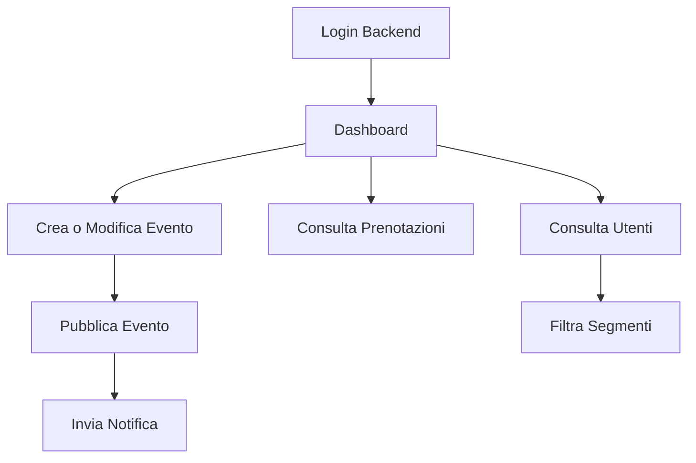

# Backend Minimo

## Obiettivo

Il backend minimo deve consentire al team del ristorante di pubblicare e gestire eventi, leggere i dati clienti, governare le prenotazioni e inviare comunicazioni essenziali senza complessita' superflua.

## Ruoli

### Admin

- gestione completa utenti
- gestione completa eventi
- gestione prenotazioni
- gestione notifiche
- accesso dashboard e configurazioni

### Staff

- creazione e modifica eventi
- consultazione utenti
- gestione prenotazioni
- invio notifiche operative

## Moduli Funzionali

### 1. Autenticazione Backend

- login admin/staff
- recupero password
- ruoli e permessi base

### 2. Gestione Utenti

- elenco utenti
- ricerca per nome, email, telefono
- filtri per sesso, fascia eta', provenienza, zona di Roma
- visualizzazione preferenze
- attivazione/disattivazione utente
- esportazione CSV

### 3. Gestione Eventi

- creazione evento
- modifica evento
- bozza / pubblicato / archiviato
- campi principali:
  - titolo
  - slug
  - descrizione breve
  - descrizione completa
  - cover image
  - data e ora
  - capienza
  - prezzo
  - tag
  - stato prenotazioni
  - evento in evidenza

### 4. Gestione Prenotazioni

- vista prenotazioni per evento
- vista prenotazioni per utente
- stati:
  - richiesta
  - confermata
  - annullata
  - lista attesa
- note interne
- export partecipanti

### 5. Segmentazione

- filtri utenti per profilo
- filtri utenti per preferenze
- filtro per partecipazione a eventi precedenti
- associazione eventi a target preferenziali

### 6. Notifiche

- invio push a tutti
- invio push a segmenti selezionati
- notifica conferma prenotazione
- notifica pubblicazione evento

### 7. Dashboard

- utenti registrati
- nuovi utenti ultimi 30 giorni
- eventi attivi
- prenotazioni aperte
- top eventi per adesione
- distribuzione per zona e fascia eta'

## Flusso Operativo Staff

## Requisiti Non Funzionali Minimi

- pannello responsive per desktop e tablet
- audit minimo su creazione e modifica eventi
- gestione immagini cover
- permessi differenziati tra admin e staff
- esportazione dati semplice

## Funzioni Rimandate a Fase 2

- pagamenti online
- QR check-in
- coupon e fidelity
- livelli membership
- automazioni marketing avanzate
