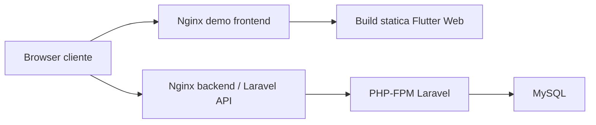

# Deploy Demo Hetzner

## Obiettivo

Pubblicare una demo browser dell'app Flutter Web sul server Hetzner già predisposto con Docker, mantenendo backend Laravel e frontend demo come servizi separati.

## Architettura Demo



## Strategia consigliata

- `frontend demo` servito come sito statico con Nginx
- `backend API` già esposto tramite il servizio Laravel esistente
- stesso host Hetzner, servizi distinti in Docker
- dominio o sottodominio dedicato alla demo in una fase successiva

## Build locale frontend

Da [frontend/app](/C:/dev/scipioni/frontend/app):

```powershell
C:\tools\flutter\bin\flutter.bat config --enable-web
C:\tools\flutter\bin\flutter.bat pub get
C:\tools\flutter\bin\flutter.bat analyze
C:\tools\flutter\bin\flutter.bat build web --dart-define=SCIPIONI_API_BASE_URL=http://localhost:8080/api/v1
```

Output atteso:

- cartella `frontend/app/build/web`

## Container frontend demo

Configurazione Nginx:

- [nginx.conf](/C:/dev/scipioni/infra/docker/frontend-demo/nginx.conf)

Questa configurazione:

- serve la build statica Flutter
- gestisce correttamente il fallback SPA su `index.html`
- applica cache lunga agli asset fingerprinted

## Compose suggerito

Quando la build web è presente, aggiungere un servizio dedicato:

```yaml
  frontend-demo:
    image: nginx:1.27-alpine
    container_name: scipioni-frontend-demo
    restart: unless-stopped
    ports:
      - "8090:80"
    volumes:
      - ./frontend/app/build/web:/usr/share/nginx/html:ro
      - ./infra/docker/frontend-demo/nginx.conf:/etc/nginx/conf.d/default.conf:ro
    depends_on: []
    networks:
      - scipioni-network
```

## Deploy su Hetzner

Sequenza minima:

1. copiare il repository sul server
2. generare la build web Flutter
3. avviare o aggiornare i container Docker
4. verificare la demo via browser

Esempio:

```bash
docker compose up -d --build
```

Se si aggiorna solo la demo web:

```bash
docker compose up -d frontend-demo
```

## Note operative

- per una demo cliente è sufficiente anche una porta dedicata, per esempio `8090`
- per una presentazione formale è meglio introdurre un reverse proxy con HTTPS
- il frontend demo per ora usa dati mock, quindi non dipende ancora dalle API
- il frontend demo ora usa eventi, profilo e prenotazioni reali dal backend
- il cliente demo seedato e' `cliente@example.com` / `password`
- il base URL API va definito via `SCIPIONI_API_BASE_URL` nelle build non locali
