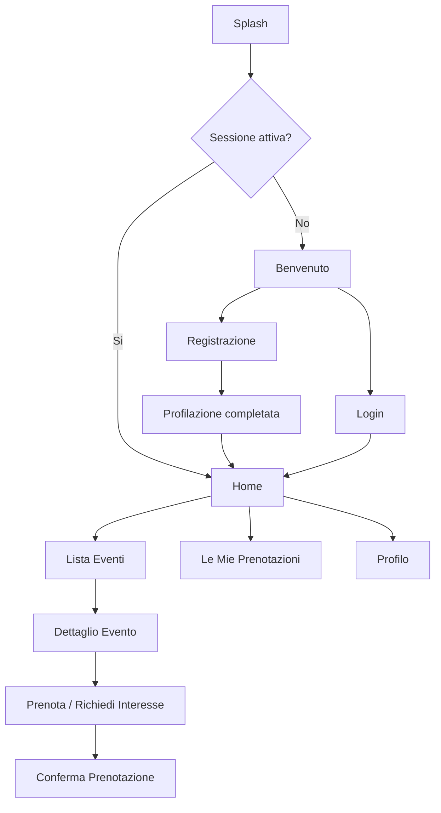
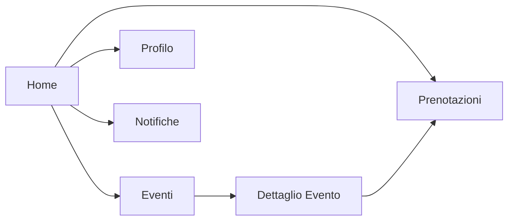

# Flussi e Schermate

## Mappa Schermate

- `Splash`
- `Benvenuto`
- `Login`
- `Registrazione`
- `Recupera Password`
- `Home`
- `Lista Eventi`
- `Dettaglio Evento`
- `Conferma Prenotazione`
- `Le Mie Prenotazioni`
- `Profilo`
- `Modifica Profilo`
- `Notifiche`

## Flusso Principale Cliente

## Flussi Chiave

### 1. Nuovo Utente

1. apre l'app
2. arriva su `Benvenuto`
3. sceglie `Registrazione`
4. inserisce dati anagrafici e di profilazione
5. accetta consensi
6. entra in `Home`

### 2. Utente Registrato

1. apre l'app
2. se la sessione e' valida entra direttamente in `Home`
3. altrimenti usa `Login`

### 3. Scoperta Evento

1. l'utente vede eventi in evidenza in `Home`
2. apre `Lista Eventi`
3. filtra o scorre le card
4. apre `Dettaglio Evento`
5. prenota o manifesta interesse

### 4. Gestione Personale

1. l'utente apre `Le Mie Prenotazioni`
2. controlla eventi futuri e passati
3. aggiorna dati e preferenze in `Profilo`

## Wireframe Testuali

## Splash

- logo centrale
- sfondo fotografico o texture coerente con il brand
- controllo sessione

## Benvenuto

- headline: club riservato Magazzino Scipioni
- breve testo introduttivo
- pulsante `Accedi`
- pulsante `Registrati`

## Login

- email
- password
- pulsante `Accedi`
- link `Password dimenticata`

## Registrazione

- nome
- cognome
- email
- telefono
- password
- sesso
- fascia eta'
- provenienza
- zona di Roma
- preferenze iniziali
- privacy
- marketing
- pulsante `Crea account`

## Home

- hero con evento in evidenza
- sezione `Consigliati per te`
- sezione `Prossimi eventi`
- sezione `Le tue prenotazioni`
- shortcut a profilo e notifiche

## Lista Eventi

- ricerca
- filtro per data
- filtro per categoria
- filtro disponibilita'
- card evento con:
  - immagine
  - titolo
  - data
  - prezzo
  - badge disponibilita'

## Dettaglio Evento

- immagine cover
- titolo
- sommario editoriale
- dettagli pratici
- posti disponibili
- prezzo
- note
- pulsante `Prenota`

## Conferma Prenotazione

- riepilogo evento
- stato prenotazione
- messaggio finale
- pulsante `Vai alle mie prenotazioni`

## Le Mie Prenotazioni

- tab `In programma`
- tab `Passate`
- stato prenotazione
- dettaglio rapido

## Profilo

- dati anagrafici
- dati di profilazione
- preferenze
- consensi
- pulsante `Modifica profilo`
- logout

## Navigazione App

## Note UX

- ridurre il numero di passaggi per arrivare al dettaglio evento
- mantenere un tono editoriale, non da e-commerce
- rendere evidenti disponibilita', data e valore dell'evento
- usare la profilazione per personalizzare la home senza appesantire la registrazione
