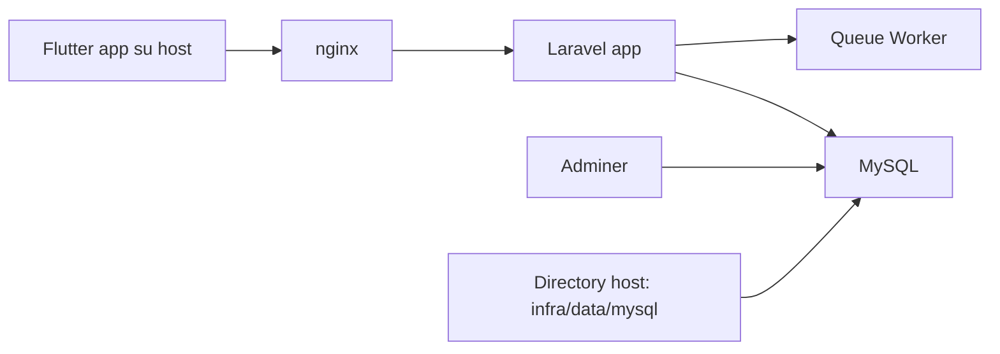

# Infrastruttura Docker

## Obiettivo

I servizi server-side sono containerizzati, mentre il codice applicativo e i dati MySQL restano appoggiati al filesystem del progetto.

Questo approccio consente:

- isolamento dei servizi
- avvio locale ripetibile
- persistenza dati fuori dai volumi Docker gestiti
- possibilita' di eliminare e ricreare i container senza perdere il database

## Servizi

- `app`: PHP-FPM con Laravel
- `queue`: worker Laravel per code asincrone
- `nginx`: reverse proxy HTTP
- `mysql`: database MySQL 8.4
- `adminer`: interfaccia web per il database

`adminer` e' mantenuto solo come tool temporaneo di sviluppo in questa fase prototipale. In una fase successiva va rimosso dallo stack e sostituito con un client esterno.

## Diagramma



## Persistenza Dati

I dati MySQL non usano un volume Docker nominato. Sono montati da:

`infra/data/mysql`

In questo modo, anche se il container `mysql` viene rimosso, i dati restano sul disco del progetto.

## Porte Locali

- backend HTTP: `http://localhost:8080`
- Adminer: `http://localhost:8081`
- MySQL host: `127.0.0.1:3307`

## Avvio

```bash
docker compose up -d --build
```

## Prima inizializzazione Laravel

Dopo il primo avvio:

```bash
docker compose exec app php artisan key:generate
docker compose exec app php artisan migrate
```

## File Principali

- [docker-compose.yml](C:/dev/scipioni/docker-compose.yml)
- [PHP Dockerfile](C:/dev/scipioni/infra/docker/php/Dockerfile)
- [PHP entrypoint](C:/dev/scipioni/infra/docker/php/entrypoint.sh)
- [Nginx config](C:/dev/scipioni/infra/docker/nginx/default.conf)
- [Docker env backend](C:/dev/scipioni/backend/.env.docker)

## Nota su Flutter

L'app Flutter non e' containerizzata. In sviluppo conviene eseguirla sull'host, collegandola all'API Dockerizzata.

Gli emulatori non sono un buon candidato per questo stack:

- `iOS Simulator` non gira in Docker
- emulatore Android in container e' possibile ma scomodo e fragile

## Evoluzione Successiva

- aggiungere `redis`
- aggiungere `mailpit`
- separare config `dev` e `prod`
- aggiungere `docker-compose.override.yml` per personalizzazioni locali

## File Ambiente

Per gli ambienti server sono stati predisposti anche:

- [backend/.env.staging](C:/dev/scipioni/backend/.env.staging)
- [backend/.env.production](C:/dev/scipioni/backend/.env.production)
- [docker-compose.staging.yml](C:/dev/scipioni/docker-compose.staging.yml)
- [docker-compose.production.yml](C:/dev/scipioni/docker-compose.production.yml)

Dettagli operativi in:

- [docs/deploy-environments.md](C:/dev/scipioni/docs/deploy-environments.md)
