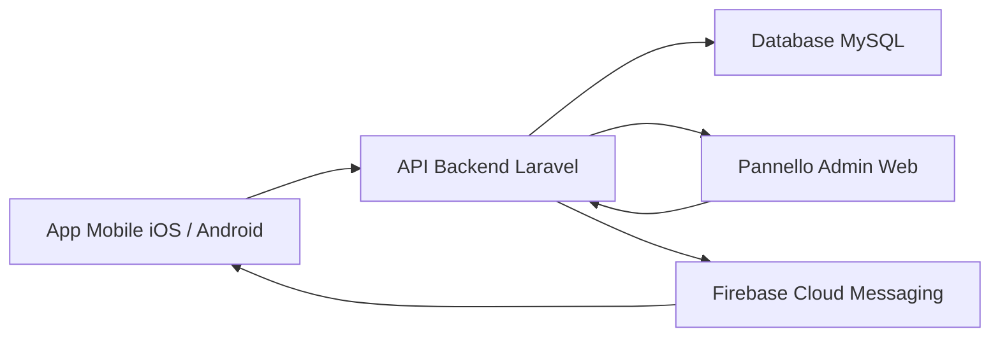

# Overview Prodotto

## Visione

L'app mobile di Magazzino Scipioni e' un club riservato per utenti registrati. L'obiettivo e' offrire un'area privata dove consultare degustazioni, eventi e attivita', con contenuti personalizzati in base al profilo utente e allo storico delle interazioni.

## Obiettivi MVP

- consentire registrazione e accesso all'area privata
- raccogliere dati di profilazione utili al ristorante
- pubblicare eventi e degustazioni dal backend web
- permettere all'utente di leggere il dettaglio di un'attivita' e prenotarsi
- consentire allo staff di segmentare gli utenti e inviare comunicazioni mirate

## Tipi di Utente

- `Cliente`: usa l'app mobile
- `Staff`: gestisce eventi, prenotazioni e comunicazioni
- `Admin`: gestisce configurazione, utenti e visione completa del backend

## Dati di Profilazione Iniziali

- nome
- cognome
- email
- telefono
- password
- sesso
- fascia eta'
- provenienza
- zona di Roma
- preferenze enogastronomiche
- preferenze tipo evento
- consenso privacy
- consenso marketing

## Modello di Esperienza

L'app non deve sembrare un catalogo generico. Deve avere il taglio di un club privato con una presentazione editoriale degli eventi, forte presenza visiva e un tono coerente con il brand Magazzino Scipioni.

## Linee Guida Grafiche

- stile elegante e caldo
- impostazione editoriale
- immagini ampie e materiche
- palette sobria: crema, bordeaux, nero carbone, accenti ottone
- tipografia con forte gerarchia tra titolo, sottotitolo e dettagli pratici

## Panoramica Architetturale

- app mobile cross-platform: `Flutter`
- backend web e pannello amministrativo: `Laravel`
- database: `MySQL`
- notifiche push: `Firebase Cloud Messaging`

## Componenti Principali

## Roadmap di Alto Livello

1. definizione requisiti MVP
2. wireframe e flussi utente
3. modellazione dati
4. pannello admin minimo
5. sviluppo app mobile
6. integrazione notifiche e test
