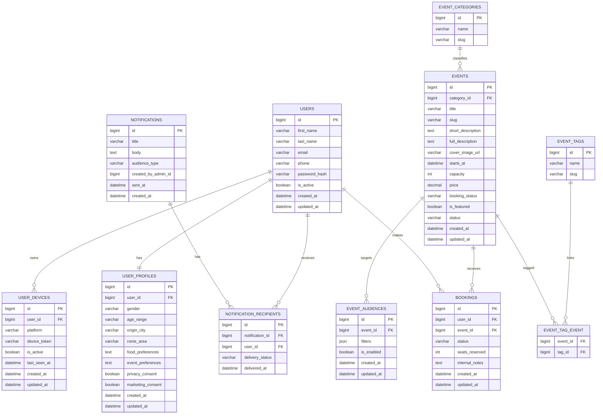
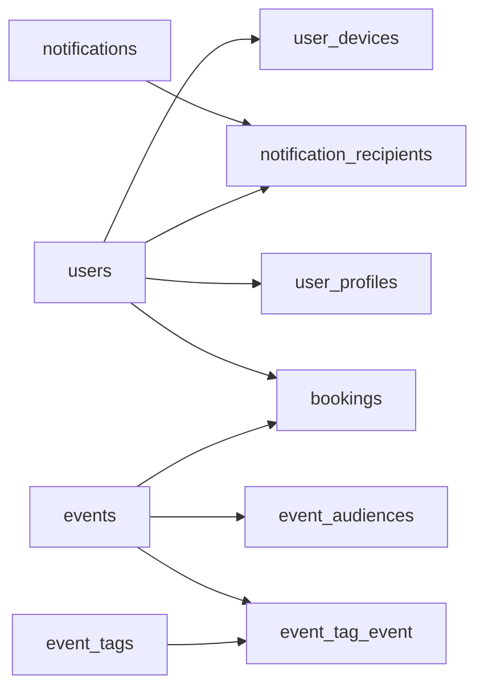

# Schema Database MySQL

## Obiettivo

Lo schema iniziale deve coprire autenticazione cliente, profilazione, eventi, prenotazioni, notifiche e utenti amministrativi.

## Entita' Principali

- `users`
- `user_profiles`
- `event_categories`
- `events`
- `event_tags`
- `event_tag_event`
- `bookings`
- `user_devices`
- `notifications`
- `notification_recipients`
- `admin_users`
- `event_audiences`

## Diagramma ER

## Tabelle e Funzioni

## `users`

Contiene le credenziali e i dati anagrafici base del cliente.

Campi principali:
- `id`
- `first_name`
- `last_name`
- `email`
- `phone`
- `password_hash`
- `is_active`
- `created_at`
- `updated_at`

Vincoli consigliati:
- `email` univoca
- `phone` indicizzato

## `user_profiles`

Contiene i dati di profilazione e i consensi.

Campi principali:
- `user_id`
- `gender`
- `age_range`
- `origin_city`
- `rome_area`
- `food_preferences`
- `event_preferences`
- `privacy_consent`
- `marketing_consent`

Vincoli consigliati:
- relazione 1:1 con `users`

## `event_categories`

Classifica gli eventi in macro categorie come degustazione, cena evento, masterclass.

## `events`

Contiene il catalogo eventi pubblicato nel backend.

Campi principali:
- `category_id`
- `title`
- `slug`
- `short_description`
- `full_description`
- `cover_image_url`
- `starts_at`
- `capacity`
- `price`
- `booking_status`
- `is_featured`
- `status`

Valori utili:
- `booking_status`: `open`, `closed`, `waitlist`
- `status`: `draft`, `published`, `archived`

## `event_tags`

Usata per temi e interessi: bollicine, rossi, jazz, vini francesi.

## `event_tag_event`

Tabella pivot tra eventi e tag.

## `bookings`

Gestisce la prenotazione dell'utente a un evento.

Campi principali:
- `user_id`
- `event_id`
- `status`
- `seats_reserved`
- `internal_notes`

Valori utili:
- `status`: `requested`, `confirmed`, `cancelled`, `waitlist`

## `notifications`

Traccia le comunicazioni push create dal backend.

## `user_devices`

Registra i device token per le notifiche push iOS e Android.

## `notification_recipients`

Registra lo stato di invio per utente.

## `admin_users`

Tabella consigliata per autenticazione separata del backend amministrativo.

Campi suggeriti:
- `id`
- `name`
- `email`
- `password_hash`
- `role`
- `is_active`
- `created_at`
- `updated_at`

## Relazioni Chiave

## Evoluzioni Future

- tabella `payments`
- tabella `checkins`
- tabella `membership_levels`
- motore campagne con template email/push
